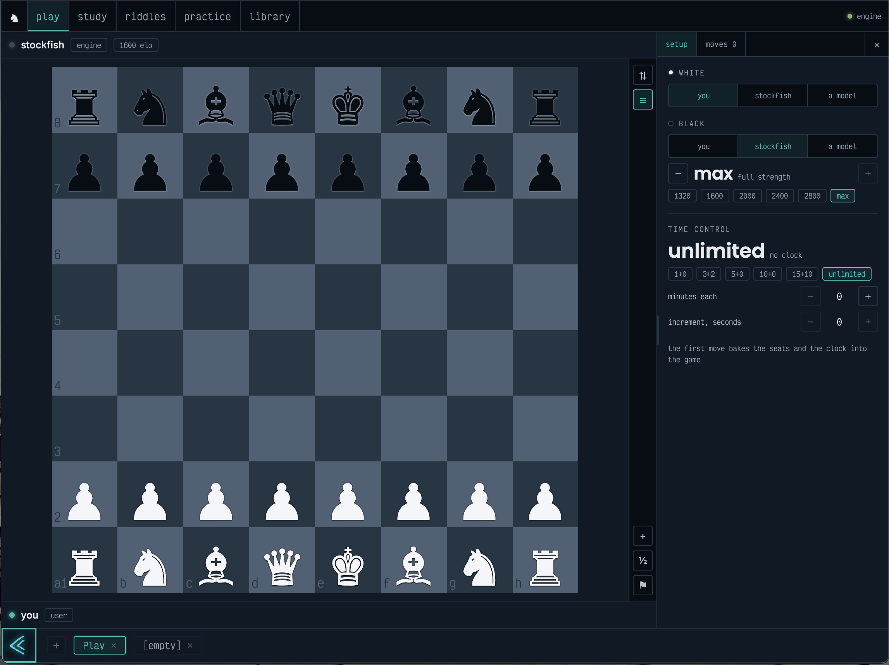

# @chess

A chess domain for [vivalence](https://github.com/vivalence/vivalence): games, positions, openings and puzzles as literals; the rules behind one door; an engine consumed, never declared; five modes over one corpus.

Play the engine or a hallucinator, post-mortem any game ply by ply, solve riddles in five levels, practise with a coach that talks, keep a library. Every mode reads and writes the same rows.



## Getting started

Prerequisite: a working `viva` CLI ([quickstart](https://github.com/vivalence/vivalence#quickstart)) and a UCI engine on the PATH.

```sh
brew install stockfish                                      # or point VIVA_SERVICE_STOCKFISH_BINARY at any UCI engine
viva registry/tap ~/.viva/registry/chess
viva instance/create @chess/instance/chess --use --init
# second start: viva instance/run
```

Without an engine the daemon still plays, imports, exports, classifies and serves riddles. `/engine/status` says so, and every engine route answers with the sentence that names the fix.

## package content

```
package.viva.js                     @chess/package/chess
instances/chess/                    @chess/instance/chess — domain + 4 topologies + 2 topographies + 5 modes, engine consumed
domain/                             @chess/domain/chess — entities, rules, aperture, tools, types
topologies/                         game · position · opening · puzzle — symbols only, one TOPOGRAPHICAL root each
topographies/                       openings (3 810 catalogued) · puzzles (1 000 riddles) — harvest.js each
services/stockfish/                 @chess/service/stockfish — the engine contract over a UCI process
modes/
  board/play                        the live game
  study/analysis                    the post-mortem
  riddle/puzzles                    the riddles
  coach/practice                    the talking coach
  library/games                     the corpus in a list
tests/                              rig.js · render.js · kit.test.js
```

### Datasets / Corpora

| Topography | Literals | Source |
|---|---|---|
| openings | 3,810 | lichess `chess-openings` TSVs, CC0 |
| puzzles | 1,000 — 200 per level | lichess puzzle dump, CC0; deviation ≤ 100, popularity ≥ 50, every solution verified legal |

| Topology | Symbols | Families |
|---|---|---|
| game | 28 | `game.variant.*` · `game.result.*` · `game.termination.*` · `game.timecontrol.*` |
| position | 9 | `position.phase.*` · `position.endgame.pieces.*` |
| opening | 506 | `opening.family.A…E` · `opening.eco.A00…E99` |
| puzzle | 67 | `puzzle.level.*` · `puzzle.theme.*` |

Datasets are plain JS arrays of `{ slug, traits, trait, symbols }`. Positions and games are never shipped — they are minted at runtime, by play and by import.

### Modes

| Mode | Type | Slug | What it does |
|---|---|---|---|
| Play | board | `play` | the live game in the buffer; seats user · engine · hallucinator, an engine strength 1320–3190 or max, a time control — all set before the first move, baked by it; a finished game seals into the corpus |
| Analysis | study | `analysis` | every ply evaluated, judged by win% lost, accuracy per side; a hallucinator explains one move; the elo ladder of any move |
| Riddles | riddle | `puzzles` | five levels, novice to master; a streak, a nudge, a reveal; a wrong move says what it was, what was wanted, and the engine's line against it; every attempt is a trace |
| Practice | coach | `practice` | agentic: the coach plays you through its tools and talks in the dock; the board is the buffer, the talk is the thread |
| Library | library | `games` | the corpus in a list; filter by result, opening, analysis; paste a PGN; open any game in the study |

A mode never imports outside its directory. The five modes each carry the same `buffer/kit/` (Shell · Board · Nav · Seat · Moves · Ladder · Theme · layout.js · open.js) and `tests/kit.test.js` pins the copies byte-equal — edit one, copy five.

Every view is a `Shell`: the nav, then seat · board · seat with a rail on the board's right edge (flip and the panel toggle on top, the mode's actions below — a destructive one arms on the first press and fires on the second), and a dock of panel tabs. `kit/layout.js` places the dock from the buffer's own measured size, never the window's: beside the board on landscape, under it on portrait, and over the board's foot as a sheet under 760px, which lifts the board by its own height until the board would drop under 240px. `f` flips, `p` shows or hides the dock, while the buffer holds the focus. The library has no board; its page is Shell's children.

The theme is a component, `kit/Theme.svelte`, never a stylesheet: the bundler keeps only the entry's JS, so an `import "./x.css"` is dropped on the floor, while a component's own `<style>` is injected on mount. Every rule in it is written `:global(.chess …)` — svelte-preprocess blanks a `:global { … }` BLOCK — and its keyframes are `-global-`. A light theme flips the ground (surface light, contrast ink), so squares and pieces read their tokens from one `:root[data-theme="…"] .chess` override naming `parchment` · `porcelain` · `datasette`; datasette presses its controls black and draws its boundaries black, so a second override gives its squares `--surface-sunk` · `--text-light`. Every other alias follows the theme as it is. A theme states no polarity, so a light theme added to dapper must be added here by name. `tests/kit.test.js` P-theme-ships bundles all five views for real and asserts the definitions, every named override and the pulse are in the served code; P-theme-reads resolves the aliases against every dapper theme and asserts the white piece reads lighter than the black, the light square lighter than the dark, and the two squares apart — a theme the kit does not flip goes red there.

### Instance

The daemon — `instances/chess/daemon.js`:

```js
import paladin from "@vivalence/paladin";

export const chess = {
  manifest: {
    type: "daemon",
    slug: "chess",
    version: "0.1.0",
    name: "Chess",
    description: "Play, study, riddles, practice, library — over one corpus of games, positions, openings and puzzles, with an engine behind the door.",
    icon: { emoji: "♞" },
  },
  kernel: [
    "@chess/domain/chess",
    "@chess/topology/game",
    "@chess/topology/position",
    "@chess/topology/opening",
    "@chess/topology/puzzle",
    "@chess/topography/openings",
    "@chess/topography/puzzles",
    "@chess/board/play",
    "@chess/study/analysis",
    "@chess/riddle/puzzles",
    "@chess/coach/practice",
    "@chess/library/games",
  ],
  consume: {
    engine: {
      module: "@chess/service/stockfish",
      statics: {
        binary: () => paladin.env.get("VIVA_SERVICE_STOCKFISH_BINARY"),
        threads: () => Number(paladin.env.get("VIVA_SERVICE_STOCKFISH_THREADS")),
        hash: () => Number(paladin.env.get("VIVA_SERVICE_STOCKFISH_HASH")),
      },
    },
  },
};
```

The instance provides the rest — `instances/chess/instance.viva.js`:

```js
export const environment = v.environment({
  VIVA_RUNTIME_ORIGIN: v.url().default("http://localhost:2501").group("addresses"),
  // … 7 addresses
  VIVA_SERVICE_STOCKFISH_BINARY: v.string().default("stockfish").group("engine"),
  VIVA_SERVICE_STOCKFISH_THREADS: v.string().default("2").group("engine"),
  VIVA_SERVICE_STOCKFISH_HASH: v.string().default("128").group("engine"),
  SECRET_VIVA_JWT: v.string({ minLength: 24 }).default(() => /* minted at first init */).group("keys"),
  SECRET_VIVA_ANTHROPIC_API_KEY: v.string().group("keys").optional(),
  SECRET_VIVA_OPENROUTER_API_KEY: v.string().group("keys").optional(),
});

export const daemons = [chess];
export const datamap = { module: "@commons/datamap/libsql" };
export const hallucinators = [/* anthropic, openrouter — a key left blank leaves its hallucinator dormant */];
export const clients = [{ manifest: { type: "client", slug: "anima" }, /* … */ }];
export const services = [{ manifest: { type: "service", slug: "multiplayer" }, module: "@commons/lighthouse/multiplayer", /* … */ }];
```

With neither key the hallucinator seats, the coach and the explainer stay silent; play, riddles and analysis still work.

## Chess domain

`@chess/domain/chess` — `EXPOSED · TOOLING`. Three entities (Literal, Symbol, Trace), the rules door, the aperture, five agent tools, and the types every surface shares (`OCCUPANT`, `SEATS`, `EVALUATION`, `REPORT`, `LADDER`, `STATUS`, …).

### Literal

**A literal is a game OR a position OR an opening OR a puzzle.** The one `TOPOGRAPHICAL` symbol says which; the runtime subscriber throws on two. Everything else the row knows rides in traits:

```
game      RECORDED     { tags, pgn, moves, initial, variant, plies }
          TERMINATED   { result, reason }
          SEATED       { white: Occupant, black: Occupant }
          CLOCKED      { initial, increment }
          OPENED       { eco, name, pgn, lastBookPly }
          SOURCED      { provider, id?, url?, importedAt }
          ANALYSED     REPORT — accuracy, acpl, counts, one judgement per ply
position  PLACED       { fen, epd, key, material, pieces, phase }
          EVALUATED    [EVALUATION…] newest first, eight kept
          LADDERED     { [elo | "full"]: { plays: [uci…], engine, movetime, at } }
          BOOKED · TABLEBASED   declared, no topography ships them yet
opening   CATALOGUED   { eco, name, pgn, moves, fen, epd, plies }
puzzle    POSED        { fen, solution, rating, themes, plays, level }
```

#### snapshots

A position — the start, reached by `literal.reach(START)`. The slug is the key: sha256 of the EPD, 64 bits, so the same position by any move order is one row and one cache line:

```json
{
  "ontology": "position",
  "slug": "05bd4852088c5cfd",
  "traits": ["PLACED"],
  "trait": {
    "PLACED": {
      "fen": "rnbqkbnr/pppppppp/8/8/8/8/PPPPPPPP/RNBQKBNR w KQkq - 0 1",
      "epd": "rnbqkbnr/pppppppp/8/8/8/8/PPPPPPPP/RNBQKBNR w KQkq -",
      "key": "05bd4852088c5cfd",
      "material": "KQRRBBNNPPPPPPPPvKQRRBBNNPPPPPPPP",
      "pieces": 32,
      "phase": "opening"
    }
  },
  "symbols": ["position", "position.phase.opening"]
}
```

`/position/eval` appends `EVALUATED`; `/position/elo` grows `LADDERED` one rung at a time. Both read the row before they touch the engine.

A game — scholar's mate, sealed through `literal.seal`. The slug is the digest of `variant|initial|moves`, so the same game imported twice is one row:

```json
{
  "ontology": "game",
  "slug": "9b2128cf972d5888",
  "traits": ["RECORDED", "TERMINATED", "SEATED", "OPENED"],
  "trait": {
    "RECORDED": {
      "tags": { "White": "beef", "Black": "stockfish", "Result": "1-0" },
      "pgn": "[White \"beef\"]\n[Black \"stockfish\"]\n[Result \"1-0\"]\n\n1. e4 e5 2. Bc4 Nc6 3. Qh5 Nf6 4. Qxf7# 1-0\n",
      "moves": ["e2e4", "e7e5", "f1c4", "b8c6", "d1h5", "g8f6", "h5f7"],
      "initial": "rnbqkbnr/pppppppp/8/8/8/8/PPPPPPPP/RNBQKBNR w KQkq - 0 1",
      "variant": "standard",
      "plies": 7
    },
    "TERMINATED": { "result": "1-0", "reason": "checkmate" },
    "SEATED": { "white": { "kind": "user" }, "black": { "kind": "engine", "elo": 1320 } },
    "OPENED": { "eco": "C23", "name": "Bishop's Opening", "pgn": "1. e4 e5 2. Bc4", "lastBookPly": 3 }
  },
  "symbols": ["game", "game.variant.standard", "game.result.white", "game.termination.checkmate", "opening.eco.C23"]
}
```

**The move tree is PGN text.** Nothing persists a node.

An opening, one line of the harvested dataset:

```json
{
  "slug": "a00-sodium-attack-durkin-gambit-183355",
  "traits": ["CATALOGUED"],
  "trait": {
    "CATALOGUED": {
      "eco": "A00",
      "name": "Sodium Attack: Durkin Gambit",
      "pgn": "1. Na3 e5 2. Nc4 Nc6 3. e4 f5",
      "moves": ["b1a3", "e7e5", "a3c4", "b8c6", "e2e4", "f7f5"],
      "fen": "r1bqkbnr/pppp2pp/2n5/4pp2/2N1P3/8/PPPP1PPP/R1BQKBNR w KQkq - 0 4",
      "epd": "r1bqkbnr/pppp2pp/2n5/4pp2/2N1P3/8/PPPP1PPP/R1BQKBNR w KQkq -",
      "plies": 6
    }
  },
  "symbols": ["opening", "opening.family.A", "opening.eco.A00"]
}
```

A puzzle — the solver owns the even plies of `solution`; the odd ones are played for them:

```json
{
  "slug": "puzzle-00c89",
  "traits": ["POSED", "SOURCED"],
  "trait": {
    "POSED": {
      "fen": "2r3k1/6pp/p1q2r2/1pn2p2/1B1pPP2/3Pn1QB/1PP2R1P/6RK w - - 4 25",
      "solution": ["g3g7"],
      "rating": 400,
      "themes": ["kingside-attack", "master", "mate", "mate-in1", "middlegame", "one-move"],
      "plays": 321,
      "level": "novice"
    },
    "SOURCED": { "provider": "lichess", "id": "00c89", "url": "https://lichess.org/training/00c89", "importedAt": "2026-09-16T19:50:07.317Z" }
  },
  "symbols": ["puzzle", "puzzle.level.novice", "puzzle.theme.kingside-attack", "puzzle.theme.mate-in1", "…"]
}
```

#### code — one owner per corpus row

`domain/entities/kernel/Literal.ts` extends the runtime's Literal with the trait enum and the corpus verbs. Every writer goes through `mint`, which finds the topology's own mode row and refuses to land a row unowned — Literal is unique on `(slug, mode)` and sqlite counts NULLs distinct, so an unowned row would have no uniqueness at all:

```js
async owner(kind) {
  const row = await this.em.findOne(ModeEntity, { type: "topology", slug: kind });
  if (!row) throw new Error(`[chess] the kernel mounts no @chess/topology/${kind} — nothing may own a ${kind} row`);
  return row;
}
```

| Verb | Does |
|---|---|
| `reach(fen)` | the ONLY writer of a position — canonical FEN, key, material, phase; upsert under the position mount |
| `evaluated(position, { depth })` · `record(position, evaluation)` | the eval cache: newest at or beyond the depth, or append (eight kept) |
| `rung(position, elo)` · `ladder(position, { elo, plays, … })` | the ladder cache: what the engine limited to `elo` played here; it only ever grows |
| `seal({ tags, moves, initial, variant, result, reason, seats, clock, source, opening })` | the ONLY writer of a game — replays the line, digests the identity, stamps result and termination symbols |
| `classify(fens)` | the deepest catalogued opening along a line — one query, last hit wins |
| `analysed(game, report)` | stamps `ANALYSED` |
| `puzzle({ level, themes, exclude })` · `pose({ id, fen, solution, rating, themes })` | one riddle at random in a level; the puzzle harvest's writer |
| `card` · `search(query)` | the list projection; slug, opening name, players and event as `$like` |

From a mode, the same verbs are the daemon's doors — the play mode's `finish()`:

```js
const line = await rules(ctx, "replay", { fen: data.initial, moves: data.moves, variant: data.variant });
const opening = await literal.classify([data.initial, ...line.plies.map((ply) => ply.fen)]);
const row = await literal.seal({ tags, moves: data.moves, initial: data.initial, variant: data.variant, result, reason, seats: data.seats, clock, opening });
```

### Symbol

The domain does not extend Symbol — a symbol is a slug with a label, minted as a line of dataset by the topologies. Four `TOPOGRAPHICAL` roots (`game` · `position` · `opening` · `puzzle`), and under each the `ONTOLOGICAL` dimensions:

```js
symbol("puzzle", "Puzzle", "A chess riddle. Core ontological dimension.", true),
...LEVELS.map(([slug, name, description]) => symbol(`puzzle.level.${slug}`, name, description)),
...THEMES.map(([slug, name, description]) => symbol(`puzzle.theme.${slug}`, name, description)),
```

A set is a where clause. `reach` stamps `position.phase.*`, `seal` stamps `game.result.*` and `opening.eco.*`, `pose` stamps `puzzle.level.*` and `puzzle.theme.*` — and every list, filter and pick resolves against them:

```js
await ctx.daemon.entities.literal.puzzle({ level: "club", themes: ["fork"] });
// → findOne({ ontology: "puzzle", symbols: ["puzzle.level.club", "puzzle.theme.fork"] }, { orderBy: random })
```

`opening.eco.*` is the one family two ontologies wear: the catalogued opening carries it, and so does every game that reaches it.

### Trace

One attempt at a puzzle — what a user did with a literal, when. `domain/entities/userspace/Trace.ts`:

```js
properties: {
  user:     { kind: "m:1", entity: () => UserEntity },
  literal:  { kind: "m:1", entity: () => LiteralEntity, nullable: true },
  mode:     { kind: "m:1", entity: () => ModeEntity, nullable: true },
  thread:   { kind: "m:1", entity: () => ThreadEntity, nullable: true },
  kind:     { type: types.string },
  signal:   { type: types.json },
  status:   { type: types.string },
  snapshot: { type: types.json },
},
filters: { user: { cond: (args) => ({ user: args.user }), default: true } }, // a solver sees only their own attempts
```

`/puzzle/attempt` is today's only writer — one row when a riddle is solved or failed, none while playing:

```json
{
  "kind": "puzzle",
  "literal": "01JQ…",
  "mode": { "type": "riddle", "slug": "puzzles" },
  "signal": { "enum": "FAILED", "moves": ["g3g6"] },
  "status": "FAILED",
  "snapshot": { "rating": 400, "level": "novice", "matched": 0, "plies": 1 }
}
```

The riddle mode reads its streak off these. A rating driver folds them later; the rows are already there.

### Rules — one door

`domain/rules/index.js` is the only runtime importer of `chessops`. FEN · UCI · SAN · PGN · EPD · key · material · phase · variants:

```js
legal({ fen, variant })        → { fen, moves, dests, turn, check, checkmate, stalemate, insufficient, end, outcome }
apply({ fen, uci, variant })   → { fen, uci, san, capture, promotion, ply, turn, check, … }
parse({ fen, san, variant })   → { uci, san }
replay({ fen, moves, variant }) → { fen, plies, checkmate, stalemate, insufficient, outcome }
pgn.make({ tags, moves, initial, variant }) · pgn.parse(text)
epd(fen) · key(fen) · material(fen) · phase(fen)
```

A mode asks in-process, never over the wire:

```js
const rules = (ctx, path, input) => ctx.daemon.call.rules[path]({ ...ctx, input, output: undefined });
```

**The buffer carries the board's affordances.** Every mode's save recomputes `dests` and `check` through this door, so a view never asks the wire what it may move, and no `$effect` in any view calls the wire.

### Engine — consumed, never declared

`consume.engine` on the daemon, `ctx.daemon.services.engine` at the call site. The contract any UCI provider fills:

```js
analyse({ fen, depth?, movetime?, multipv? })  → AsyncIterable<{ kind: "info", depth, multipv, cp?, mate?, pv } | { kind: "bestmove", uci, ponder }>
evaluate({ fen, depth?, movetime?, multipv? }) → { engine, depth, multipv: [{ cp?, mate?, pv }], bestmove }
play({ fen, elo?, movetime?, depth? })         → { uci, ponder }
about()                                         → { binary, threads, hash, started, engine? }   never spawns
stop() · close()
```

Scores are from the side to move's view. One process per daemon, one search at a time, spawned lazily — a missing binary is a sentence at the first call, never a boot failure.

**The elo of a move is the highest limited strength that still plays it at least half the time.** `/position/elo` searches the position at `1320 · 1600 · 2000 · 2400 · 2800` and full strength (stockfish's `UCI_Elo` floor is 1320), `samples` times per rung (default 5, `movetime` 100) because limited-strength play is randomised, caches every sample on the position literal (a later ask with more `samples` tops the cache up, never repeats), and answers a number for the MOVE, never a rating of the player. `spread` is the highest strength that played it at all; `settled` is false where the strengths split over several equal moves — there any number is a sample, the verdict says "one of several equal moves", and the bands show `k/n`. Measured on Stockfish 19 at the start position: the full-strength verdict holds across runs, the 1320–2400 rungs spread 1/5–2/5 over c4 · d4 · e4 · Nf3.

```json
{ "uci": "e2e4", "san": "e4", "elo": 2000, "spread": 2400, "settled": true, "only": false, "unanimous": false,
  "best": { "uci": "d2d4", "san": "d4" }, "switches": { "elo": 2400, "uci": "d2d4", "san": "d4" },
  "samples": 5, "hits": 4, "verdict": "a club player's move",
  "sentence": "Stockfish limited to 2000 still picks e4 in 4 of 5 searches; at 2400 it switches to d4." }
```

### Aperture

```
/engine/status
/rules/legal · /rules/apply · /rules/parse · /rules/replay · /rules/pgn
/position/reach · /position/eval · /position/elo
/game/import · /game/export · /game/list · /game/count
/opening/classify
/analysis/game                                  streamed — an async generator IS SSE, so a deep pass never hits the daemon-call ceiling
/puzzle/next · /puzzle/attempt · /puzzle/hint · /puzzle/reveal
/userspace/entities/trace
```

### Agent tools

Five, exported from the domain, armed as `chess_*` by any `TOOLING` mode that slurps them — the coach is one:

| Tool | Does |
|---|---|
| `/legal` | read a position: whose move, every legal move as UCI and SAN, check, mate. "Call this before choosing a move — the list is the only moves you may play." |
| `/assess` | the engine's assessment, cached per position. "Without an engine it says so; do not guess an evaluation." |
| `/elo` | the ladder for one move |
| `/classify` | name the opening a line reaches |
| `/puzzle` | fetch a riddle in a level |

## Tests

From the repo root (the suites and the fake engine share its config):

```sh
deno test --config deno.jsonc -A --no-check ~/.viva/registry/chess/
```

```
ok | 21 passed (101 steps) | 0 failed (7s)
```

`domain/tests/` pins the rules (perft-1, SAN↔UCI, PGN round trip, EPD transposition) and the domain (one position row across routes, null owner refused, the eval cache, the ladder, seal, classify, the analysis stream, the puzzle trace, the tools). `services/stockfish/tests/` drives the provider over a fake UCI process. Each mode's `tests/` walks its verbs on the offline rig and server-renders its view from a row the rig produced (`tests/render.js`) — what the template prints, not only that it compiles. Effects need a mount; that is the live walk, and it has not happened yet.

## Not built

remote seats (the lighthouse relays nothing yet) · `BOOKED` / `TABLEBASED` topographies · ratings and spaced repetition over puzzles (the traces are there) · a piece set (the board draws Unicode glyphs) · a lichess / chess.com URL fetch on import (the library takes PGN text) · a live click-through.
